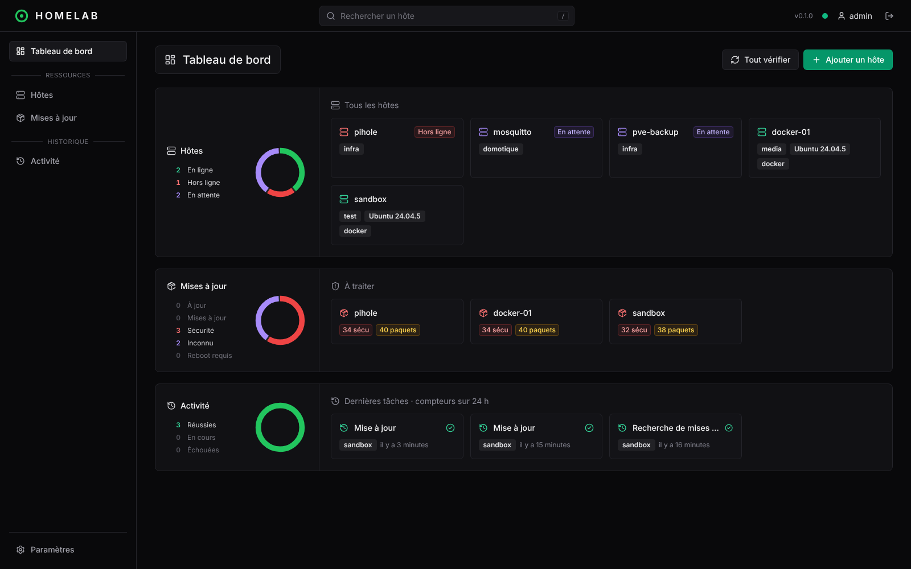
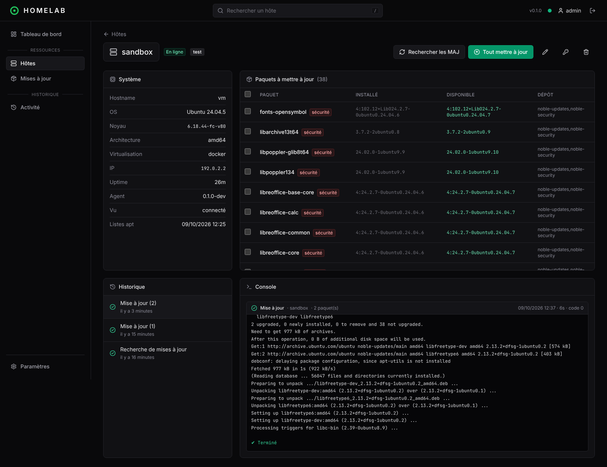
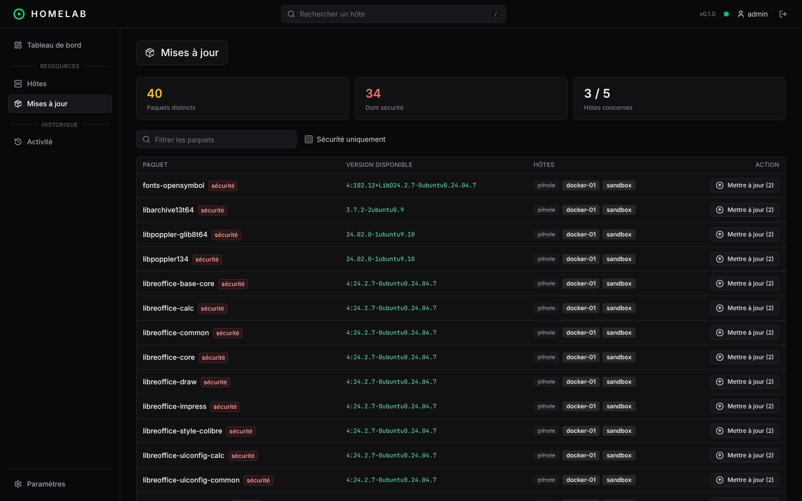

# Homelab Manager

Administration d'un homelab (une vingtaine de serveurs, VM et LXC) depuis une seule interface : état des hôtes, mises à jour système (APT), et bientôt stacks Docker, sauvegardes et standardisation des hôtes.

Pensé pour le réseau local : un hub en conteneur, un agent léger par hôte, aucun port à ouvrir sur les hôtes.



## Fonctionnalités (MVP)

- **Inventaire** des hôtes : OS, noyau, architecture, virtualisation (LXC, KVM…), IP, uptime, état de connexion en temps réel.
- **Mises à jour APT** : paquets à mettre à jour, mises à jour de sécurité, paquets bloqués (`hold`), redémarrage requis, ancienneté des listes de paquets.
- **Actions depuis l'UI** : `apt-get update`, mise à jour complète ou sélection de paquets, sur un hôte ou en masse. Les logs s'affichent en direct.
- **Vue par paquet** : « openssl est à mettre à jour sur 14 hôtes », et mise à jour en un clic partout.
- **Vérification planifiée** : le hub demande aux agents de rafraîchir leurs listes de paquets toutes les 12 h (configurable).
- **Historique** des tâches avec leurs sorties (conservé 90 jours).
- Interface **dark**, en français, utilisable sur mobile.

| Fiche hôte | Vue par paquet |
| --- | --- |
|  |  |

## Installation

### 1. Le hub

Récupère [`compose.yml`](compose.yml) et [`.env.example`](.env.example), puis :

```sh
cp .env.example .env      # optionnel : PUBLIC_URL, CHECK_INTERVAL_HOURS, HUB_PORT…
docker compose up -d
```

L'image `mathmath350/homelab-manager` est multi-arch (amd64, arm64). Ouvre `http://<ip-du-hub>:3000` : au premier lancement, l'interface te demande de créer le compte administrateur.

### 2. Les agents

Dans l'UI : **Ajouter un hôte**, puis copie la commande affichée et lance-la en root sur l'hôte :

```sh
curl -fsSL http://<ip-du-hub>:3000/install.sh | sh -s -- <token>
```

Le script télécharge le binaire de l'agent pour la bonne architecture (amd64 / arm64) depuis le hub, puis installe le service systemd `homelab-agent`. L'hôte apparaît en ligne quelques secondes plus tard.

| Action | Commande |
| --- | --- |
| Mettre à jour l'agent (token conservé) | `curl -fsSL http://<hub>:3000/install.sh \| sh` |
| Désinstaller | `curl -fsSL http://<hub>:3000/install.sh \| sh -s -- --uninstall` |

Prérequis côté hôte : Debian ou Ubuntu, systemd, `curl` ou `wget`.

## Configuration du hub

Variables d'environnement, lues depuis `.env` par `docker compose`, `make dev` et `make start` :

| Variable | Défaut | Rôle |
| --- | --- | --- |
| `MONGO_URL` | `mongodb://localhost:27017/homelab` | Base MongoDB |
| `PORT` | `3000` | Port HTTP du hub |
| `HUB_PORT` | `3000` | Port publié par `docker compose` |
| `HUB_IMAGE` | `mathmath350/homelab-manager:latest` | Image utilisée par `docker compose` |
| `PUBLIC_URL` | URL utilisée dans le navigateur | URL par laquelle les agents joignent le hub |
| `CHECK_INTERVAL_HOURS` | `12` | Fréquence de l'`apt-get update` automatique (`0` = désactivé) |
| `SESSION_DAYS` | `30` | Durée des sessions |
| `COOKIE_SECURE` | `false` | `true` si le hub est servi en HTTPS |
| `TRUST_PROXY` | `false` | `true` derrière un reverse proxy |
| `LOG_LEVEL` | `info` | Niveau de logs |

## Architecture

```
            navigateur ──REST + SSE──┐
                                     ▼
┌──────────┐  WebSocket sortant  ┌─────────┐      ┌─────────┐
│  agent   │ ──────────────────► │   hub   │ ───► │ MongoDB │
│ (Go, root│ ◄── ordres (JSON) ─ │ Node.js │      └─────────┘
│ systemd) │                     │ + React │
└──────────┘                     └─────────┘
```

- **`agent/`** (Go, binaire statique d'environ 6 Mo). Il ouvre une connexion WebSocket **sortante** vers le hub et se reconnecte tout seul. Il remonte l'état du système et des paquets, et exécute uniquement une liste blanche d'actions (`apt_report`, `apt_update`, `apt_upgrade`). Il n'exécute jamais de commande arbitraire, et les noms de paquets sont validés des deux côtés.
- **`hub/`** (Node.js, Fastify, TypeScript). API REST sous `/api`, flux temps réel pour l'UI (Server-Sent Events sur `/api/events`), WebSocket des agents sur `/agent/ws`, script d'installation et binaires de l'agent.
- **`web/`** (React, Vite, Tailwind, TanStack Query). Servi par le hub en production.

### Sécurité

- Un seul compte admin. Mot de passe haché en scrypt, session en cookie `HttpOnly` / `SameSite=Strict`, limitation des tentatives de connexion.
- Un token par agent, de la forme `<hostId>.<secret>`. Seul le hash du secret est stocké, et régénérer le token déconnecte immédiatement l'ancien agent.
- Conçu pour rester sur le LAN : ne l'expose pas sur Internet sans reverse proxy HTTPS et authentification supplémentaire.

### API REST (extrait)

| Méthode | Route | Description |
| --- | --- | --- |
| `GET` | `/api/hosts` | Liste des hôtes avec leur état |
| `POST` | `/api/hosts` | Crée un hôte et renvoie son token et la commande d'installation |
| `PATCH` / `DELETE` | `/api/hosts/:id` | Modifie / supprime un hôte |
| `POST` | `/api/hosts/:id/token` | Régénère le token |
| `POST` | `/api/hosts/:id/jobs` | Lance `apt_update` / `apt_upgrade` (avec `packages` optionnel) |
| `POST` | `/api/jobs/bulk` | Même action sur plusieurs hôtes |
| `GET` | `/api/jobs`, `/api/jobs/:id` | Historique, détail avec logs |
| `GET` | `/api/events` | Flux SSE (`host`, `job`, `job.log`) |

## Développement

Prérequis : Node.js 22, Go 1.24, GNU Make, et Docker pour MongoDB et l'image. `make` (ou `make help`) liste toutes les commandes.

```sh
make install            # dépendances hub + web + agent
make mongo              # MongoDB local dans un conteneur (homelab-mongo)
make dev                # hub (rechargement auto) + interface sur http://localhost:5173, Ctrl-C arrête tout
make agent-run TOKEN=…  # agent local contre le hub (en root pour apt-get update / upgrade)
```

| Commande | Rôle |
| --- | --- |
| `make start` | Build complet puis hub en mode production (UI servie sur le port 3000) |
| `make lint` | gofmt, go vet, typage du hub, eslint de l'interface |
| `make test` | Tests unitaires agent + hub |
| `make build` | Agent (amd64 + arm64), hub et interface |
| `make check` | lint + test + build : ce que lance la CI |
| `make docker-build` | Image locale `homelab-manager:latest` |
| `make docker-up` / `docker-down` / `docker-logs` | Stack compose avec l'image locale |

La configuration locale se met dans `.env` (voir `.env.example`), comme en production.

### Release

Les releases se font en local et publient sur Docker Hub, comme pour komodo2mqtt :

```sh
docker login
make docker-release         # X.Y.Z → X.Y.Z+1
make docker-release-minor   # X.Y.Z → X.Y+1.0
make docker-release-major   # X.Y.Z → X+1.0.0
git push origin main --tags
```

Une release lance d'abord `make check`. Elle refuse un arbre de travail non commité. Ensuite elle :
1. met à jour la version (`VERSION`, `hub/` et `web/package.json`) et la commite (« 🔖 Release X.Y.Z ») ;
2. construit l'image amd64 + arm64 et la pousse sous les tags `latest`, `X.Y.Z` et le hash du commit ;
3. crée le tag git `vX.Y.Z`.

`DOCKER_USER` (défaut `mathmath350`) et `PLATFORMS` (défaut `linux/amd64,linux/arm64`) sont surchargeables.

## Feuille de route

- [x] Hub, agents, inventaire et mises à jour APT
- [ ] Docker : état des conteneurs, stacks compose synchronisées hôte ↔ hub (détection de dérive, push, rollback)
- [ ] Alertes (ntfy, MQTT, Telegram…)
- [ ] Suivi des sauvegardes (heartbeats, alertes en cas d'échec ou d'absence)
- [ ] Standardisation : profils de paquets, clés SSH, accès
- [ ] Métriques système légères
