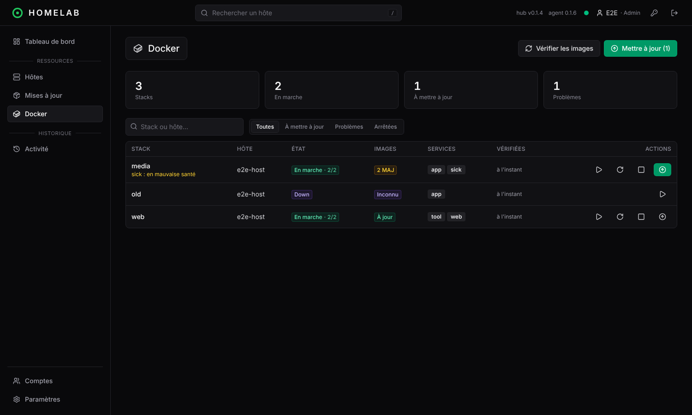
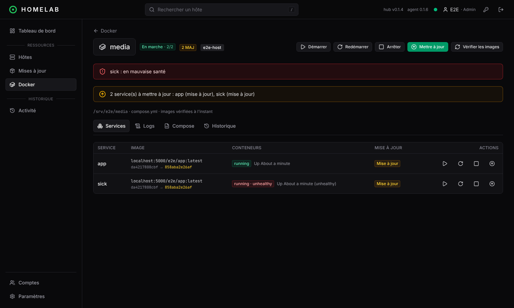

# Docker

Le module Docker suit les **stacks docker compose déjà présentes sur les hôtes**. L'hôte reste la source de vérité : rien n'est déployé depuis le hub, on y voit l'état des stacks, les images à mettre à jour, et on agit dessus.

## Prérequis

- Docker Engine et le plugin **compose v2** (`docker compose version` doit répondre) sur l'hôte ;
- un agent à jour : il détecte Docker tout seul et l'annonce au hub. Un Docker installé plus tard est pris en compte dans la demi-heure, ou tout de suite en redémarrant l'agent (`systemctl restart homelab-agent`).

Rien à configurer : les stacks sont découvertes à partir des labels que compose pose sur ses conteneurs (`com.docker.compose.project`, dossier et fichiers du projet).

## Ce qui est suivi

- **Stacks**, avec leur état :

  | État | Signification |
  |---|---|
  | En marche | tous les conteneurs tournent |
  | Partielle | une partie seulement des conteneurs tourne |
  | Arrêtée | conteneurs présents mais arrêtés (`docker compose stop`) |
  | Down | plus aucun conteneur (`docker compose down`) |

  Une stack « down » reste listée tant que ses fichiers compose existent, pour pouvoir la redémarrer. **Oublier** (admin, sur la page de la stack) la retire de la liste.
- **Services et conteneurs** : image, état, santé (`healthy`, `unhealthy`), statut.
- **Problèmes** : stack partielle, conteneur en mauvaise santé ou qui redémarre en boucle. Une stack arrêtée volontairement n'est pas un problème.
- L'état est rafraîchi en direct : l'agent suit les événements Docker (démarrage, arrêt, santé…), y compris pour les actions faites en dehors du hub, et renvoie un relevé complet toutes les 5 minutes.

## Mises à jour des images

**Vérifier les images** compare, pour chaque image utilisée par une stack, le digest de l'image locale à celui du même tag sur son registre. L'agent fait une requête `HEAD` sur le manifeste : **rien n'est téléchargé** et Docker Hub ne la compte pas dans son quota de pulls. La vérification est aussi lancée automatiquement, au même rythme que l'`apt-get update` (**Paramètres › Agent**, 12 h par défaut).

| Statut | Signification |
|---|---|
| Mise à jour | une image plus récente est publiée sur le registre |
| À redéployer | la nouvelle image est déjà téléchargée, mais le conteneur tourne encore sur l'ancienne |
| À jour | image identique à celle du registre |
| Inconnu | jamais vérifiée, ou non vérifiable (voir ci-dessous) |

Registres : Docker Hub, ghcr.io, lscr.io, quay.io et tout registre compatible avec l'API v2. Les registres en HTTP simple (`localhost` et les `insecure-registries` du démon) sont acceptés. Pour une image privée, l'agent utilise les identifiants de `docker login` stockés en clair dans `/root/.docker/config.json`.

Non vérifiables :
- les images épinglées par digest (`image@sha256:…`) ;
- les images construites sur l'hôte et absentes de tout registre ;
- les registres privés dont les identifiants passent par un *credential helper*.

## Actions

Sur une stack, ou sur un seul de ses services (page de la stack) :

| Action | Commande sur l'hôte |
|---|---|
| Démarrer | `docker compose up -d` : démarre, et recrée les conteneurs dont la configuration a changé |
| Arrêter | `docker compose stop` (les conteneurs ne sont pas supprimés) |
| Redémarrer | `docker compose restart` |
| Mettre à jour | `docker compose pull`, `docker compose up -d`, puis `docker image prune -f` (seulement les images devenues orphelines) |

Les actions sont des tâches comme les autres : sortie en direct, historique (onglet **Historique** de la stack et page Activité), une tâche à la fois par hôte. **Mettre à jour (n)** sur la page Docker lance la mise à jour de toutes les stacks concernées.

L'agent ne prend jamais un chemin venant du hub : il n'agit que sur les stacks qu'il a lui-même découvertes, avec leur dossier et leurs fichiers compose, et sur les services qu'elles contiennent.

## Logs et fichiers compose

- **Logs** : dernières lignes de la stack (tous les services, triées dans l'ordre chronologique) ou d'un service, avec suivi toutes les 5 secondes.
- **Compose** : les fichiers compose de la stack tels qu'ils sont sur l'hôte, en lecture seule. Les fichiers d'environnement (`.env`) sont affichés avec leurs **valeurs masquées**.

Logs et fichiers compose peuvent contenir des secrets : ils sont réservés aux rôles **admin** et **operator**. Le rôle **viewer** voit les stacks, leurs états et leurs mises à jour.

## Home Assistant

Avec l'intégration activée, chaque stack devient un sous-composant de son hôte (`hôte · stack`) : état, conteneurs en marche, entité `update` « Images » installable depuis Home Assistant, boutons Démarrer, Arrêter et Redémarrer. Ses problèmes remontent en alertes vers l'hôte puis vers Homelab Manager. Voir [Home Assistant](home-assistant.md).

## Limites

- Seuls les conteneurs lancés par **docker compose** sont suivis (pas les `docker run` isolés).
- Le compose n'est pas modifiable depuis le hub, et le hub ne déploie pas de nouvelle stack : c'est l'étape suivante (synchronisation hôte ↔ hub).
- Pas de mise à jour automatique des stacks : la mise à jour se lance à la main, depuis l'interface ou Home Assistant.
